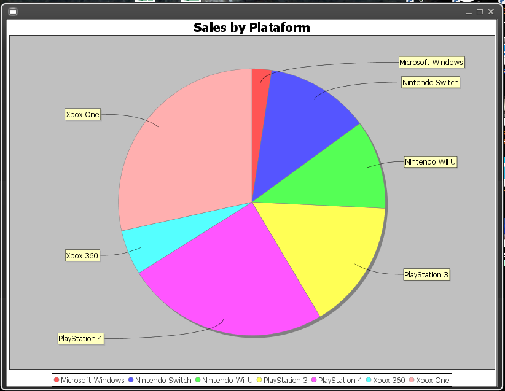

# homero-java-sample | [English](README.md) - Português
Projeto simples que fiz no Netbeans 8.2 como trabalho durante meu curso de Técnico em Informática, no IFSP.
A ideia era representar números de vendas fictícias sobre a indústria de jogos utilizando gráficos.
Para fazer isso, utilizei as bibliotecas [JFreeCharts](http://www.jfree.org/jfreechart/) para representação dos gráficos
e [Synthetica](http://www.jyloo.com/synthetica/) para mudar a aparência dos forms Swing.

Exemplo de telas do projeto:

Tela principal:  

Exemplo de uso de um gráfico:  

